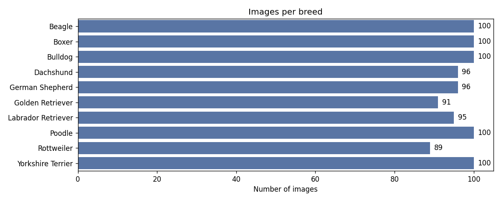
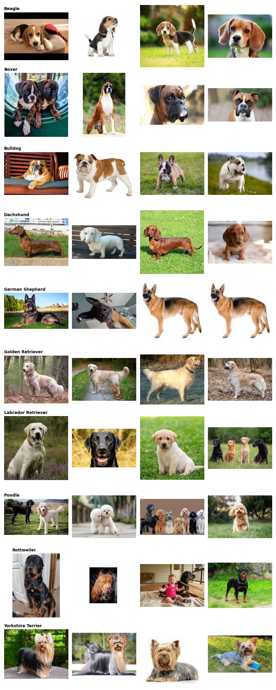

# 🐶 Dog Breed Classifier

[](https://www.python.org/)
[](https://pytorch.org/)
[](https://babajide-dog-breed-classifier.streamlit.app)

An end-to-end deep learning project that identifies a dog's breed from a photo. It covers the full workflow: data exploration, transfer learning with PyTorch, evaluation, and a web app anyone can use.

**👉 Live demo:** https://babajide-dog-breed-classifier.streamlit.app

<!-- After deploying, add a screenshot of the app: save it as assets/app_screenshot.png and uncomment:

-->

## Overview

| | |
|---|---|
| **Task** | Multi-class image classification (10 dog breeds) |
| **Dataset** | [Dog Breed Image Dataset — Kaggle](https://www.kaggle.com/datasets/khushikhushikhushi/dog-breed-image-dataset) (~1,000 images) |
| **Model** | EfficientNet-B0 pretrained on ImageNet, fine-tuned in two stages |
| **Framework** | PyTorch + torchvision |
| **App** | Streamlit, hosted on Streamlit Community Cloud |

**Breeds:** Beagle · Boxer · Bulldog · Dachshund · German Shepherd · Golden Retriever · Labrador Retriever · Poodle · Rottweiler · Yorkshire Terrier

## Results

| Metric | Score |
|---|---|
| **Test accuracy** | **99.3%** (145 / 146) |
| Best validation accuracy | 100% |
| Train / validation / test images | 676 / 145 / 146 |
| Epochs trained | 17 (5 head-only + 12 fine-tuning) |

The model got every test image right except one German Shepherd, which it predicted as a Yorkshire Terrier. Training and validation curves track each other closely, so the model isn't overfitting despite the small dataset. Most of the gain comes in the fine-tuning stage (the dashed line).

<p align="center">
  <br>
  
</p>

> With only ~15 test images per breed, a single mistake moves accuracy by about 0.7 points, so treat 99.3% as "very high on this dataset" rather than a precise figure. Real-world photos (odd angles, mixed breeds) will be harder.

<details>
<summary>Dataset overview</summary>

<p align="center">
  <br>
  
</p>
</details>

## Approach

1. **Exploratory data analysis**: class balance, image sizes and colour modes, sample grid. Corrupt files are detected and skipped.
2. **Stratified split**: 70% train / 15% validation / 15% test, keeping breed proportions equal across splits.
3. **Augmentation**: random resized crops, flips, rotation and colour jitter to reduce overfitting on a small dataset.
4. **Transfer learning**:
   - *Stage 1*: freeze the EfficientNet backbone and train only the new classifier head (lr 1e-3).
   - *Stage 2*: unfreeze everything and fine-tune with a low learning rate (1e-4), cosine annealing, label smoothing and early stopping.
5. **Evaluation**: accuracy, top-3 accuracy, per-class precision/recall/F1, confusion matrix and a gallery of misclassified images.
6. **Deployment**: the best checkpoint is exported and served by a Streamlit app that shows the top-5 predictions, a confidence warning, and facts about the predicted breed.

## Project structure

```
dog-breed-classifier/
├── notebooks/
│   └── dog_breed_classification.ipynb   # EDA, training, evaluation, export
├── model/
│   ├── dog_breed_efficientnet_b0.pth    # trained weights (from the notebook)
│   ├── class_names.json                 # label order used in training
│   └── metrics.json                     # test metrics (from the notebook)
├── assets/                              # figures used in this README
├── examples/                            # optional example images offered in the app
├── .streamlit/config.toml               # app theme and upload limit
├── streamlit_app.py                     # Streamlit web app
├── model_utils.py                       # model architecture, preprocessing, inference
├── breed_info.json                      # breed facts shown in the app
├── requirements.txt                     # app dependencies (used by Streamlit Cloud)
└── requirements-train.txt               # extra dependencies for the notebook
```

## Getting started

### 1. Train the model (Kaggle, free GPU — about 5–10 minutes)

1. Go to [kaggle.com/code](https://www.kaggle.com/code) → **New Notebook** → **File → Import Notebook** → upload `notebooks/dog_breed_classification.ipynb`.
2. In the right panel, click **Add Input**, search for *Dog Breed Image Dataset* (by khushikhushikhushi) and add it.
3. **Settings → Accelerator → GPU T4 x2** (or P100).
4. **Run All**.
5. Open the **Output** panel and download `dog_breed_artifacts.zip` and `dog_breed_assets.zip`.
6. Unzip them into this repo so you have `model/dog_breed_efficientnet_b0.pth`, `model/class_names.json`, `model/metrics.json` and the `assets/*.png` figures.

> Prefer Google Colab? Upload the notebook, set **Runtime → Change runtime type → T4 GPU**, and Run All. It downloads the dataset with `kagglehub` and downloads the zip files when done.

### 2. Run the app locally

```bash
git clone https://github.com/BabajideAlao-knn/dog-breed-classifier.git
cd dog-breed-classifier
python -m venv .venv && source .venv/bin/activate   # Windows: .venv\Scripts\activate
pip install -r requirements.txt
streamlit run streamlit_app.py
```

Open http://localhost:8501 and upload a dog photo.

## Deploying to Streamlit Community Cloud (free public link)

The app deploys straight from this GitHub repo; the trained model is already in `model/`, so nothing has to be uploaded by hand.

1. Go to [share.streamlit.io](https://share.streamlit.io) and **sign in with GitHub**.
2. Click **Create app → Deploy a public app from GitHub**.
3. Fill in:
   - **Repository:** `BabajideAlao-knn/dog-breed-classifier`
   - **Branch:** `main`
   - **Main file path:** `streamlit_app.py`
   - **App URL:** `babajide-dog-breed-classifier`
4. Click **Deploy**. The first build installs PyTorch and takes a few minutes; then the app is live at
   https://babajide-dog-breed-classifier.streamlit.app

Every push to `main` redeploys the app automatically.

## Limitations and future work

- The model knows only 10 breeds; mixed breeds or other breeds get mapped to the closest of the 10. The app warns when confidence is below 50%.
- There is no "not a dog" class, so non-dog photos still get a breed prediction.
- With ~100 images per breed, larger backbones (EfficientNet-B3, ConvNeXt-Tiny), MixUp/CutMix or test-time augmentation could improve accuracy further.
- A next step could be extending to all 120 breeds of the Stanford Dogs dataset.

## Acknowledgements

- Dataset: [Dog Breed Image Dataset](https://www.kaggle.com/datasets/khushikhushikhushi/dog-breed-image-dataset) on Kaggle
- Pretrained weights: [torchvision EfficientNet-B0](https://pytorch.org/vision/stable/models/efficientnet.html)

## Author

**Babajide Alao** — [GitHub @BabajideAlao-knn](https://github.com/BabajideAlao-knn)

## License

Code released under the [MIT License](LICENSE). Check the dataset's Kaggle page for its own licence terms.
