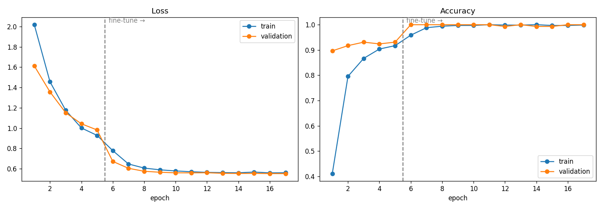
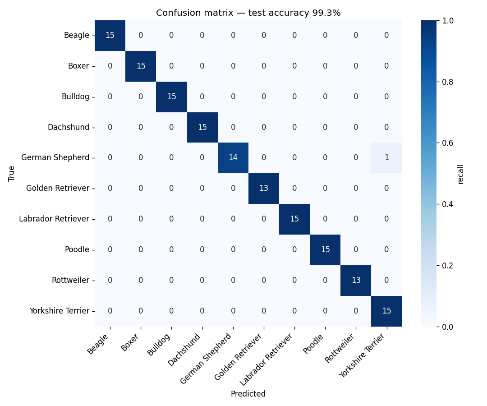

# 🐶 Dog Breed Classifier

[](https://www.python.org/)
[](https://pytorch.org/)
[](https://www.gradio.app/)
[](https://huggingface.co/spaces/YOUR_HF_USERNAME/dog-breed-classifier)

An end-to-end deep learning project that identifies a dog's breed from a photo. It covers the full workflow: data exploration, transfer learning with PyTorch, evaluation, and a web app anyone can use.

**👉 Live demo:** https://huggingface.co/spaces/YOUR_HF_USERNAME/dog-breed-classifier

<!-- After deploying, add a screenshot of the app: save it as assets/app_screenshot.png and uncomment:

-->

## Overview

| | |
|---|---|
| **Task** | Multi-class image classification (10 dog breeds) |
| **Dataset** | [Dog Breed Image Dataset — Kaggle](https://www.kaggle.com/datasets/khushikhushikhushi/dog-breed-image-dataset) (~1,000 images) |
| **Model** | EfficientNet-B0 pretrained on ImageNet, fine-tuned in two stages |
| **Framework** | PyTorch + torchvision |
| **App** | Gradio, hosted on Hugging Face Spaces |

**Breeds:** Beagle · Boxer · Bulldog · Dachshund · German Shepherd · Golden Retriever · Labrador Retriever · Poodle · Rottweiler · Yorkshire Terrier

## Results

<!-- Fill these in from model/metrics.json after training -->
| Metric | Score |
|---|---|
| Test accuracy | _XX.X%_ |
| Top-3 accuracy | _XX.X%_ |
| Test images | _~150 (held out, never seen in training)_ |

<p align="center">
  <br>
  
</p>

## Approach

1. **Exploratory data analysis**: class balance, image sizes and colour modes, sample grid. Corrupt files are detected and skipped.
2. **Stratified split**: 70% train / 15% validation / 15% test, keeping breed proportions equal across splits.
3. **Augmentation**: random resized crops, flips, rotation and colour jitter to reduce overfitting on a small dataset.
4. **Transfer learning**:
   - *Stage 1*: freeze the EfficientNet backbone and train only the new classifier head (lr 1e-3).
   - *Stage 2*: unfreeze everything and fine-tune with a low learning rate (1e-4), cosine annealing, label smoothing and early stopping.
5. **Evaluation**: accuracy, top-3 accuracy, per-class precision/recall/F1, confusion matrix and a gallery of misclassified images.
6. **Deployment**: the best checkpoint is exported and served by a Gradio app that shows the top-5 predictions, a confidence warning, and facts about the predicted breed.

## Project structure

```
dog-breed-classifier/
├── notebooks/
│   └── dog_breed_classification.ipynb   # EDA, training, evaluation, export
├── model/
│   ├── dog_breed_efficientnet_b0.pth    # trained weights (from the notebook)
│   ├── class_names.json                 # label order used in training
│   └── metrics.json                     # test metrics (from the notebook)
├── assets/                              # figures used in this README
├── examples/                            # sample images shown in the app
├── app.py                               # Gradio web app
├── model_utils.py                       # model architecture, preprocessing, inference
├── breed_info.json                      # breed facts shown in the app
├── requirements.txt                     # app dependencies (also used by HF Spaces)
└── requirements-train.txt               # extra dependencies for the notebook
```

## Getting started

### 1. Train the model (Kaggle, free GPU — about 5–10 minutes)

1. Go to [kaggle.com/code](https://www.kaggle.com/code) → **New Notebook** → **File → Import Notebook** → upload `notebooks/dog_breed_classification.ipynb`.
2. In the right panel, click **Add Input**, search for *Dog Breed Image Dataset* (by khushikhushikhushi) and add it.
3. **Settings → Accelerator → GPU T4 x2** (or P100).
4. **Run All**.
5. Open the **Output** panel and download `dog_breed_artifacts.zip` and `dog_breed_assets.zip`.
6. Unzip them into this repo so you have `model/dog_breed_efficientnet_b0.pth`, `model/class_names.json`, `model/metrics.json` and the `assets/*.png` figures.

> Prefer Google Colab? Upload the notebook, set **Runtime → Change runtime type → T4 GPU**, and Run All. It downloads the dataset with `kagglehub` and downloads the zip files when done.

### 2. Run the app locally

```bash
git clone https://github.com/BabajideAlao-knn/dog-breed-classifier.git
cd dog-breed-classifier
python -m venv .venv && source .venv/bin/activate   # Windows: .venv\Scripts\activate
pip install -r requirements.txt
python app.py
```

Open http://127.0.0.1:7860 and upload a dog photo.

## Deploying to Hugging Face Spaces (free public link)

1. Create a free account at [huggingface.co](https://huggingface.co/join).
2. Go to **New → Space**. Name it `dog-breed-classifier`, choose **Gradio** as the SDK, template **Blank**, hardware **CPU basic (free)**, visibility **Public**, then **Create Space**.
3. In the Space, open **Files → Add file → Upload files** and upload:
   - `app.py`, `model_utils.py`, `breed_info.json`, `requirements.txt`
   - the whole `model/` folder (drag the folder in so the path stays `model/...`)
   - optionally the `examples/` folder with a few dog photos
4. Click **Commit**. The Space builds for a few minutes, then your app is live at
   `https://huggingface.co/spaces/YOUR_HF_USERNAME/dog-breed-classifier` — share that link.
5. Replace `YOUR_HF_USERNAME` in this README with your username.

<details>
<summary>Alternative: push with git</summary>

```bash
pip install huggingface_hub
huggingface-cli login                      # paste a write token from hf.co/settings/tokens
git clone https://huggingface.co/spaces/YOUR_HF_USERNAME/dog-breed-classifier hf-space
cp -r app.py model_utils.py breed_info.json requirements.txt model examples hf-space/
cd hf-space
git lfs install && git lfs track "*.pth"   # weights are >10 MB, so they go through Git LFS
git add . && git commit -m "Deploy dog breed classifier" && git push
```
</details>

## Pushing this project to GitHub

```bash
cd dog-breed-classifier
git remote add origin https://github.com/BabajideAlao-knn/dog-breed-classifier.git
git branch -M main
git push -u origin main
```

(Create an **empty** repository named `dog-breed-classifier` on GitHub first — no README or licence — so the push doesn't conflict.)

## Limitations and future work

- The model knows only 10 breeds; mixed breeds or other breeds get mapped to the closest of the 10. The app warns when confidence is below 50%.
- There is no "not a dog" class, so non-dog photos still get a breed prediction.
- With ~100 images per breed, larger backbones (EfficientNet-B3, ConvNeXt-Tiny), MixUp/CutMix or test-time augmentation could improve accuracy further.
- A next step could be extending to all 120 breeds of the Stanford Dogs dataset.

## Acknowledgements

- Dataset: [Dog Breed Image Dataset](https://www.kaggle.com/datasets/khushikhushikhushi/dog-breed-image-dataset) on Kaggle
- Pretrained weights: [torchvision EfficientNet-B0](https://pytorch.org/vision/stable/models/efficientnet.html)

## Author

**Babajide Alao** — [GitHub @BabajideAlao-knn](https://github.com/BabajideAlao-knn)

## License

Code released under the [MIT License](LICENSE). Check the dataset's Kaggle page for its own licence terms.
